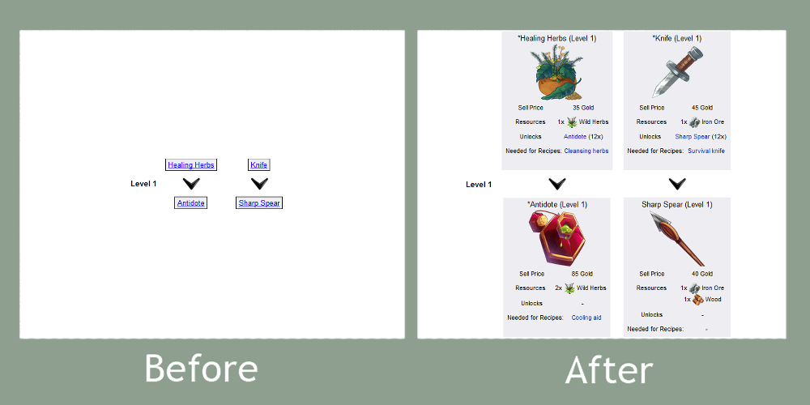

# Better Swords & Potions 2 wiki items

Usercript for dead site.

## What it did
Items on workers pages looks better:

## How to install
* **If you use Mozilla Firefox**
  + Install [Greasemonkey](https://addons.mozilla.org/ru/firefox/addon/greasemonkey/) addon.
  + Open [script](https://github.com/ColdSpirit0/Better-Swords-and-Potions-2-wiki-items/raw/master/script.user.js) and follow instructions.
  + Open [Shopkeeper](http://www.edgebee.com/wiki/index.php?title=Shopkeeper) or [other worker](http://www.edgebee.com/wiki/index.php?title=Swords_%26_Potions_2#Workers) page and look at result.

* **If you use Google Chrome or Safari**
  + Install [Tampermonkey](https://tampermonkey.net/) addon.
  + Open [script](https://github.com/ColdSpirit0/Better-Swords-and-Potions-2-wiki-items/raw/master/script.user.js) and follow instructions.
  + Open [Shopkeeper](http://www.edgebee.com/wiki/index.php?title=Shopkeeper) or [other worker](http://www.edgebee.com/wiki/index.php?title=Swords_%26_Potions_2#Workers) page and look at result.
